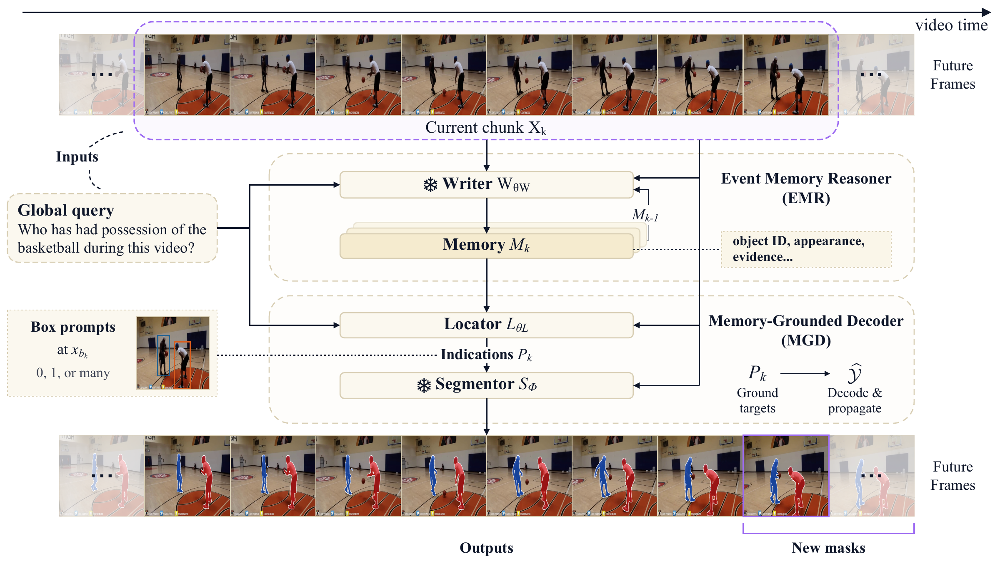

# Sekai: Incremental Event Memory for Generalized Reasoning Video Segmentation

Generalized Reasoning Video Segmentation (GRVS) asks a streaming system to segment the currently visible objects satisfying a query, including conditions established by earlier events. Sekai uses an Event Memory Reasoner (EMR) to maintain query-relevant event memory and a Memory-Grounded Decoder (MGD) to locate and segment the current targets.



Figure 4 from the paper. The frozen writer updates event memory; the locator and segmentor ground the targets and propagate masks using arrived frames.

This repository provides inference code, prompts, seven Isekai example annotations, and CPU evaluation scripts. Isekai contains 60 videos, 197 queries, and 12,569 scoring points. The examples contain **7 videos, 32 queries, and 2,198 scoring points**. Full Isekai annotations will be released **upon publication**.

| Component | Contents or input |
|---|---|
| Inference | EMR writer, MGD locator, segmentor adapter, prompts and configuration |
| Examples | Seven annotations and source/instance mappings |
| Evaluation | Isekai scorer and GroundMoRe asset preparation |
| SAM integration | Patch for the specified upstream revision |
| Model files | User-supplied Qwen, Sekai locator and SAM checkpoints |
| Verification | CPU evaluation, annotation checks and saved-response regression |

## CPU setup and example evaluation

Use Python 3.13 for CPU evaluation and asset preparation:

```sh
python -m venv ../sekai-cpu-env
# Activate the environment for your shell.
python -m pip install -r requirements-cpu.txt
python -B tools/check_examples.py
```

Obtain `groundmore_v2.tar` from the [GroundMoRe distribution](https://huggingface.co/datasets/groundmore/GroundMoRe/tree/main) under its source terms and extract its `annotations` directory. Each clip provides `images/frame_*.jpg` and indexed `masks/frame_*.png`. The preparation script copies the selected RGB frames and converts each source instance ID to a binary mask using `examples/asset_map.json` and the per-video mappings.

```sh
python -B tools/rebuild_examples.py --groundmore-root /path/to/groundmore/annotations --output ../example-assets
python -B tools/evaluate_examples.py prepare --assets ../example-assets --output ../example-inputs
python -B tools/evaluate_examples.py score --inputs ../example-inputs --data-root ../example-assets --prediction-root /path/to/saved-union-pngs --output ../example-evaluation
```

An existing Isekai asset tree can also be used through `--source-root /path/to/isekai-assets` in place of `--groundmore-root`.

With `--prediction-root`, provide union-mask PNGs at `VIDEO/QUERY/FRAME.png`, using six-digit frame indices. To score outputs from the inference command below, use `--run ../example-run` instead; this also validates the saved instance masks, event records and run configuration.

The evaluator compares prediction and ground-truth union masks at every scoring point using J (region IoU) and F (boundary F-measure). Under the original experimental scoring policy:

- Missing or invalid predictions receive **J=F=0**, including when ground truth is empty.
- Valid double-empty masks score 1; valid single-empty masks score 0.
- Scores are averaged within each video, then equally across videos. Subgroups filter points before applying the same averaging.
- Every declared scoring point contributes to the denominator. Reports include coverage and missing/invalid prediction counts.

Scores use 0–1 units; generated tables use percentages. Coverage counts valid saved predictions, including fallback masks. These commands evaluate the seven examples using the Isekai metric.

## Inference

Use a separate Linux environment with Python 3.10 and CUDA for inference. `requirements-inference.txt` records the Python dependencies used by the research implementation, including PyTorch 2.6.0, Transformers 4.57.1 and PEFT 0.17.1. CPU evaluation uses its own environment and dependency file.

Apply the supplied patch to SAM upstream revision [`8f0b7f4d4e7`](https://github.com/facebookresearch/sam3/commit/8f0b7f4d4e7). Run these commands from the Sekai repository root:

```sh
python3.10 -m venv ../sekai-infer-env
. ../sekai-infer-env/bin/activate
python -m pip install -r requirements-inference.txt
git clone https://github.com/facebookresearch/sam3.git ../sam-backend
git -C ../sam-backend checkout 8f0b7f4d4e7
git -C ../sam-backend apply --check "$PWD/third_party/sam-causal.patch"
git -C ../sam-backend apply "$PWD/third_party/sam-causal.patch"
python -m pip install -e ../sam-backend
```

The patch supplies the `strict_causal` and `strict_research_checkpoint` interfaces used by the segmentor. Source files and dependencies remain local after installation.

Prepare these model files:

| Environment variable | Local asset |
|---|---|
| `SEKAI_BASE_MODEL` | [Qwen3-VL-8B-Instruct](https://huggingface.co/Qwen/Qwen3-VL-8B-Instruct), including tokenizer and processor files |
| `SEKAI_LOCATOR_CHECKPOINT` | User-supplied Sekai checkpoint with LoRA and direct merger/normalization parameters |
| `SEKAI_SAM_SOURCE` | The patched `sam-backend` directory |
| `SEKAI_SAM_CHECKPOINT` | `sam3.1_multiplex.pt` from [SAM 3.1](https://huggingface.co/facebook/sam3.1), obtained under its model terms |

Set these variables to absolute local paths and run:

```sh
python -B tools/infer.py --config configs/inference.json --manifest ../example-inputs/inference_manifest.json --output ../example-run
```

`configs/inference.json` supplies inference parameters; environment variables resolve external asset paths. Missing assets or incompatible backend interfaces raise errors. The inference manifest contains query text and ordered RGB frames.

`core/memory.py` defines the writer prompt, serialization, rendering and 128-token validation. `core/writer.py` and `core/locator.py` render fresh user messages with the base model's native chat template. `core/constrained.py` defines the locator grammar. The locator returns `{"bbox_2d": [[x1,y1,x2,y2], ...]}` with normalized coordinates in [0,1000]; `{"bbox_2d": []}` denotes an empty selection.

Frame zero is processed alone, followed by nonoverlapping eight-frame chunks and the final partial chunk. Visual preprocessing uses 4,096–401,408 pixels and repeats the final arrived frame when temporal padding is needed. Both calls use BF16/SDPA and fresh language contexts. The writer uses the frozen base model, greedy decoding, a 640-token generation limit and at most three identical attempts. The locator uses greedy decoding with the JSON grammar and a 256-token limit. The seed is 20260918.

A rejected writer update retains accepted memory and segmentation state and skips the locator. A valid empty locator response clears active segmentation while preserving memory. An invalid locator response retains the previous segmentation choice. Endpoint boxes affect that endpoint and subsequent arrived frames; the segmentor reconstructs the arrived segment for propagation.

## Example and evaluation formats

The seven examples cover dark-box contact, supporting a child at a basket, basketball after dribbling, a stroller and doll, a rope toy, sofa jumping, and a hard hat followed by safety glasses. They contain 498 ordered frames and 2,220 query/frame labels. The `score` flags select 2,198 points and exclude 22; inference outputs every arrived frame.

Each `examples/VIDEO.json` contains:

| Field | Meaning |
|---|---|
| `video.frames` | Frame index, source frame ID, RGB path, dimensions and instance-mask mapping |
| `queries` | Query text, family, event type and target role |
| `events` | Event criterion, candidates, participant roles, intervals, confirmation times and supporting observations |
| `labels` | Per-frame eligibility, visibility, output IDs, scoring flag, causal support and ground-truth mask references |

`eligible_ids` records historical qualification; `visible_ids` records current visibility; `output_ids` is their intersection. Participant IDs refer to source instances. Query, event and label IDs provide stable references within the examples. Evaluation uses the supplied per-frame labels and scoring flags. Events and target labels belong to the evaluation inputs.

Event confirmation times and interval bounds are separate fields. A null end time denotes an unspecified end. `semantic_exception` records source annotation exceptions. Supporting observations describe the history behind each label.

Asset preparation checks required files, image dimensions and instance-mask mappings against `asset_map.json`. `tools/evaluate_examples.py prepare` writes:

- `inference_manifest.json`: query text, ordered RGB frame paths and frame identities.
- `scoring_points.json`: selected scoring points, ground-truth paths and subgroup labels.
- `predictions_manifest.json`: expected union PNG paths.
- `source_excluded_points.json`: unscored points.
- `subset.json`: counts and the local asset root.

Scoring validates these manifests against the example annotations. Missing or invalid ground-truth assets stop evaluation.

For another Isekai scoring manifest, use:

```sh
python -B evaluation/evaluate.py --points /path/to/scoring-points.json --predictions /path/to/predictions.json --data-root /path/to/gt --prediction-root /path/to/predictions --output ../evaluation.json
```

Each scoring point has `video`, `query_id`, `frame`, `shape: [height,width]`, and `gt_masks: [relative PNG paths]`. Prediction records have `query_id`, `frame`, and `masks: [relative PNG paths]`. `masks: []` represents a valid empty prediction; `invalid: true` marks an invalid record. Masks must be single-channel and match the declared shape. Missing entries or files count as missing; duplicate or unexpected prediction keys are rejected.

`examples/scoring_classification.json` supplies the recorded query family, visible target count, evidence age and history subset for each point. Evidence-age classifications use the recorded timing proxies and NEVER-specific anchors; evidence age is assigned to nonempty ground truth. History subsets cover NOW/EVER/NEVER. The table's `Other` category excludes those families and LATEST; the paper figure uses separate temporal-order and other-history categories.

## License

Copyright 2026 The Sekai Authors. Sekai-authored code is licensed under the [Apache License 2.0](LICENSE). `evaluation/metrics.py` is derived from the DAVIS evaluation toolkit under [BSD 3-Clause](third_party/DAVIS_LICENSE). The SAM patch is distributed under the [SAM License](third_party/SAM_LICENSE). File-level attribution is listed in [third_party/NOTICE.md](third_party/NOTICE.md).

The Sekai-authored queries, event records and target-set labels in the seven examples are licensed under [Creative Commons Attribution-NonCommercial 4.0 International](examples/LICENSE) (**CC BY-NC 4.0**). Attribute them to The Sekai Authors, retain the source credits below and identify modifications when sharing adaptations. The license permits noncommercial copying, sharing and adaptation under its terms.

GroundMoRe specifies CC BY-NC 4.0 in its [official supplementary material, Section 11](https://openaccess.thecvf.com/content/CVPR2025/supplemental/Deng_Motion-Grounded_Video_Reasoning_CVPR_2025_supplemental.pdf). Source videos, images, masks and the constituent material in Figure 4 retain their respective rights.

## Video sources

The video in Figure 4 and all seven examples originate from [GroundMoRe](https://groundmore.github.io/), introduced by Deng et al. in [Motion-Grounded Video Reasoning: Understanding and Perceiving Motion at Pixel Level (CVPR 2025)](https://openaccess.thecvf.com/content/CVPR2025/html/Deng_Motion-Grounded_Video_Reasoning_Understanding_and_Perceiving_Motion_at_Pixel_Level_CVPR_2025_paper.html). The source dataset is available from its [official distribution](https://huggingface.co/datasets/groundmore/GroundMoRe). Isekai adds temporal queries, event records and target-set labels; source frames and instance masks come from GroundMoRe.

The following table preserves the source clip identifiers and credits the original video publishers. The links point to the original full videos; the clip identifiers specify the excerpts used by GroundMoRe. Source-frame and instance mappings for the seven examples are retained in `examples/asset_map.json`.

| Use / Isekai video ID | GroundMoRe clip | Original video | Publisher |
|---|---|---|---|
| Figure 4: basketball possession (`gmf583b609b54d`) | `EKn6tKf7sh4_0630_0635` | [DROPPING OFF BONE COLLECTOR 1V1 IRL!](https://www.youtube.com/watch?v=EKn6tKf7sh4) | FlightReacts |
| Example: dark-box contact (`gma24ac5776a70`) | `_7h7J01tyvY_0054_0100` | [Building a PC with my 3 Year Old... Again!](https://www.youtube.com/watch?v=_7h7J01tyvY) | Linus Tech Tips |
| Example: supporting a child at a basket (`gmb450302b1ce5`) | `X0_tNjncG24_1954_2006` | [Vegan Family \| What We Eat in a Day Healthy & Easy!](https://www.youtube.com/watch?v=X0_tNjncG24) | The Schoeller Family |
| Example: four-player basketball (`gmc10189bbff76`) | `vfDlEiph3d8_0500_0515` | [Flight & CashNasty 2v2 Basketball Against JayNasty & Jay!](https://www.youtube.com/watch?v=vfDlEiph3d8) | CashNasty |
| Example: stroller and doll (`gm3aa74619f9a7`) | `KahSso_vgW8_0758_0813` | [10 OUTDOOR ACTIVITIES FOR TODDLERS l free and cheap](https://www.youtube.com/watch?v=KahSso_vgW8) | Wewen Fam |
| Example: rope toy (`gm876d609773a8`) | `NomMansxnQM_0315_0330` | [Babies and Dogs Playing Tug of War](https://www.youtube.com/watch?v=NomMansxnQM) | CrazyFunnyStuffCFS |
| Example: sofa jumping (`gmf6f14b2700ea`) | `gReGmQwSEu0_2505_2520` | [Surprising Our Daughter With Puppies!](https://www.youtube.com/watch?v=gReGmQwSEu0) | The Schoeller Family |
| Example: hard hat followed by safety glasses (`gm4145155100d5`) | `lfoTLeFooR4_0451_0456` | [Construction Safety Training Video // Over 40 Topics](https://www.youtube.com/watch?v=lfoTLeFooR4) | Resonate Pictures |

Figure 4 uses a separate clip from the four-player basketball example. Its mask overlays were prepared from annotations for the architecture illustration. Original video watermarks are retained. Source videos, RGB frames and masks are supplied through the source dataset; Figure 4 is included as the paper illustration.

